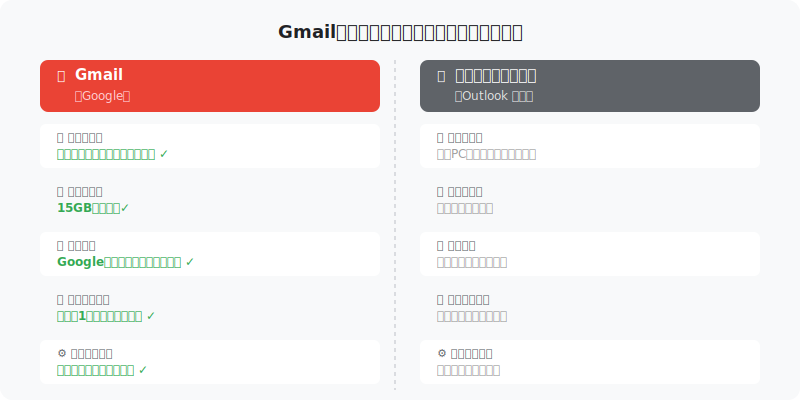
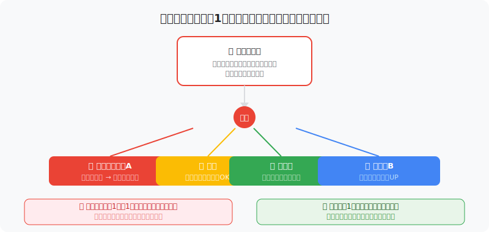
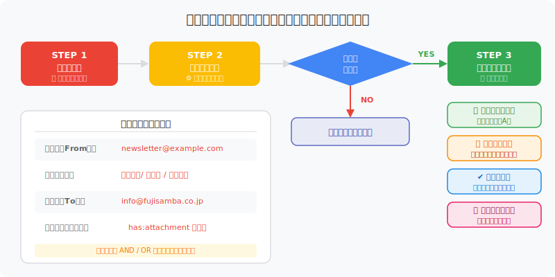

# Gmailの使い方【IT未経験者向け完全ガイド2026年版】

**スラッグ:** gmail-beginner-guide
**対象読者:** 中小企業のIT未経験従業員
**公開先:** Studio CMS
**著者:** 株式会社ふじサンバ DX支援部門
**更新日:** 2026年3月

---

## はじめに：Gmailをマスターすれば仕事が変わる

「メールの返信を見落としてしまった」「重要なメールがどこにあるか分からない」——そんな経験はありませんか？

Gmailは世界で最も多く使われているメールサービスです。ただのメール送受信ツールと思っていたら大間違い。**ラベル・フィルター・署名・スレッド表示**という4つの機能を使いこなすだけで、メール管理が劇的に楽になります。

この記事では、IT未経験の方でも迷わず設定・活用できるよう、画面操作を一つひとつ丁寧に解説します。

---

## Gmailとは？他のメールとの違い

Gmailは、Google社が提供する無料のWebメールサービスです。OutlookやThunderbirdなど他のメールソフトと比べて、以下の点で優れています。

| 比較項目 | Gmail | 従来のメールソフト |
|---------|-------|----------------|
| 使える場所 | ブラウザ・スマホ・タブレット（どこでもOK） | 主にPC |
| インストール | 不要（ブラウザで即使える） | 必要 |
| ストレージ | 15GB（無料） | 端末の容量に依存 |
| 検索機能 | 強力（Google検索と同レベル） | 限定的 |
| 自動振り分け | フィルター機能で完全自動化 | 設定が複雑 |
| スレッド表示 | 同じ件名のメールを1束にまとめる | バラバラに表示 |

<!-- 図解01: Gmailとその他メールの違い比較図 -->


---

## 1. スレッド表示：会話の流れを一目で把握する

### スレッド表示とは？

Gmailの大きな特徴のひとつが「スレッド表示」です。同じ件名でやり取りしたメールを、会話のように1か所にまとめて表示します。

**例：**「〇〇の件について」という件名で10通やり取りしても、受信トレイには**1行**だけ表示されます。クリックすると、すべての会話が時系列で確認できます。

### スレッド表示のオン/オフ設定

1. 右上の歯車アイコン（設定）をクリック
2. 「すべての設定を表示」をクリック
3. 「全般」タブを開く
4. 「スレッド表示」の項目を見つける
5. 「スレッド表示ON」または「スレッド表示OFF」を選択
6. 画面下の「変更を保存」をクリック

> **ポイント：** 最初はスレッド表示ONがおすすめです。過去のやり取りを遡りやすく、返信漏れを防げます。

---

## 2. ラベル：メールを色分けして整理する

### ラベルとは？

Gmailの「ラベル」は、メールに貼る**カラータグ**のようなものです。フォルダーに似ていますが、1通のメールに**複数のラベルを付けられる**点が違います。

**例：**「〇〇プロジェクトの請求書」というメールに「プロジェクトA」「経理」の2つのラベルを同時に付けることができます。

<!-- 図解02: ラベルの仕組み図解 -->


### ラベルの作成手順

1. 画面左のサイドバーを下にスクロール
2. 「新しいラベルを作成」をクリック
3. ラベル名を入力（例：「案件A」「取引先B」「要返信」）
4. 「作成」をクリック

### ラベルに色を付ける

1. 作成したラベルにマウスを合わせる
2. 右に現れる「3点メニュー（…）」をクリック
3. 「ラベルの色」から好きな色を選ぶ

> **活用例：**
> - 赤：「要返信」（緊急）
> - 青：「取引先A」
> - 緑：「社内連絡」
> - 黄：「後で確認」

---

## 3. フィルター：メールを自動で振り分ける

### フィルターとは？

「毎回同じ送り主のメールをラベルに入れるのが面倒」と感じたら、**フィルター機能**が解決します。特定の条件に合うメールが届いたとき、**自動でラベル付け・既読化・アーカイブ**などの処理を行います。

<!-- 図解03: フィルター設定フロー図 -->


### フィルターの設定手順

**STEP 1：フィルター作成画面を開く**

1. 右上の歯車アイコン →「すべての設定を表示」
2. 「フィルターとブロック中のアドレス」タブをクリック
3. 「新しいフィルターを作成」をクリック

**STEP 2：条件を設定する**

以下の条件を組み合わせて設定できます：

| 条件 | 設定例 |
|------|--------|
| 送信者（From） | newsletter@example.com |
| 受信者（To） | info@fujisamba.co.jp |
| 件名に含む | 【重要】 |
| 本文に含む | 請求書 |

**STEP 3：アクションを設定する**

条件に合うメールが届いたとき、以下の処理が自動で実行されます：

- ラベルを付ける
- 受信トレイをスキップ（自動アーカイブ）
- 既読にする
- 削除する
- スターを付ける

**STEP 4：「フィルターを作成」をクリックして完了**

> **活用例：**
> - 取引先からのメール → 自動でラベル「取引先A」を付ける
> - メールマガジン → 自動で受信トレイをスキップ＋ラベル「マガジン」
> - 「【請求書】」が件名に含まれる → 自動でスターを付ける

---

## 4. 署名：毎回の入力を省略する

### 署名とは？

メールの末尾に自動で付く**差出人情報**のことです。名前・会社名・部署・電話番号・メールアドレスなどを事前登録しておけば、送信のたびに入力する手間が省けます。

### 署名の設定手順

1. 右上の歯車アイコン →「すべての設定を表示」
2. 「全般」タブをスクロールして「署名」セクションへ
3. 「新規作成」をクリックして署名名を入力（例：「通常署名」）
4. テキストエリアに署名内容を入力する
5. 「変更を保存」をクリック

### 署名の記載例

```
━━━━━━━━━━━━━━━━━━━━━━━━
株式会社ふじサンバ　DX支援部
山田 太郎（やまだ たろう）

〒XXX-XXXX 東京都〇〇区〇〇町1-2-3
TEL: 03-XXXX-XXXX　FAX: 03-XXXX-XXXX
Email: yamada@fujisamba.co.jp
Web: https://fujisamba.co.jp
━━━━━━━━━━━━━━━━━━━━━━━━
```

> **ポイント：** 署名は複数登録できます。社外向け・社内向けで使い分けるとプロらしい印象になります。

---

## 5. 検索機能：目的のメールを瞬時に見つける

Gmailの検索機能はGoogleと同じエンジンを使っており、非常に強力です。

### 便利な検索コマンド

| 検索コマンド | 意味 | 例 |
|------------|------|----|
| `from:` | 送信者で検索 | `from:yamada@example.com` |
| `to:` | 受信者で検索 | `to:info@fujisamba.co.jp` |
| `subject:` | 件名で検索 | `subject:請求書` |
| `has:attachment` | 添付ファイルあり | `has:attachment` |
| `label:` | ラベルで絞り込み | `label:取引先A` |
| `after:` | 日付以降 | `after:2026/01/01` |
| `before:` | 日付以前 | `before:2026/03/01` |
| `is:unread` | 未読のみ | `is:unread` |

**組み合わせ例：**
`from:yamada@example.com has:attachment after:2026/01/01`
→ 2026年1月以降に山田さんから届いた添付ファイル付きメール

---

## まとめ：今日から始める4つのアクション

| 機能 | 今日やること |
|------|-----------|
| スレッド表示 | オンになっているか確認する |
| ラベル | 「要返信」「取引先」「社内」の3つを作成する |
| フィルター | 最もよく来るメルマガ1件を自動アーカイブ設定する |
| 署名 | 会社名・名前・連絡先を登録する |

Gmailの4機能をマスターするだけで、1日のメール処理時間を大幅に短縮できます。まずは「署名の登録」から始めてみてください。設定は5分もあれば完了します。

ご不明な点があれば、株式会社ふじサンバのDX支援チームまでお気軽にお問い合わせください。

---

**関連記事：**
- Googleドライブの使い方【IT未経験者向け完全ガイド2026年版】
- Googleカレンダーで予定管理を効率化する方法
- Google Meetでオンライン会議を始める手順
